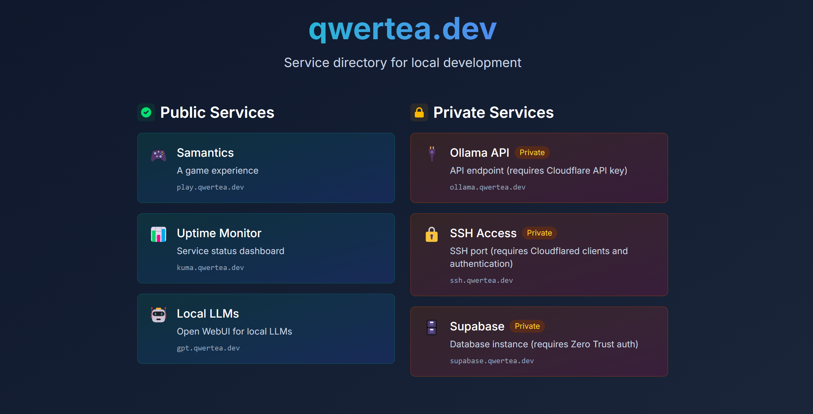

# qwertea.dev - Service Directory Homepage

A clean, minimalist directory homepage for qwertea.dev that serves as a central navigation hub for various subdomain services. The site displays both public and private services with visual distinctions and provides links to each service.



## Features

- Clean, modern UI with a dark theme
- Visual distinction between public and private services
- Responsive design that works on all devices
- Built with React, TypeScript, and Tailwind CSS
- Runs on Bun

## Services Listed

**Public Services:**
- play.qwertea.dev - Samantics game
- kuma.qwertea.dev - Uptime monitor
- gpt.qwertea.dev - Open WebUI for local LLMs

**Private Services:**
- ollama.qwertea.dev - API endpoint (requires Cloudflare API key)
- ssh.qwertea.dev - SSH port (requires Cloudflared clients and authentication)
- supabase.qwertea.dev - Supabase instance (locked behind Zero Trust auth)

## Development

To install dependencies:

```bash
bun install
```

To start a development server:

```bash
bun dev
```

To run for production:

```bash
bun start
```

## About

This project runs on a desktop with an RTX 3080 GPU using WSL (Windows Subsystem for Linux) with Cloudflare tunnels to expose local services to the web.

Created by [Samin Amanat](https://saminamanat.com)
